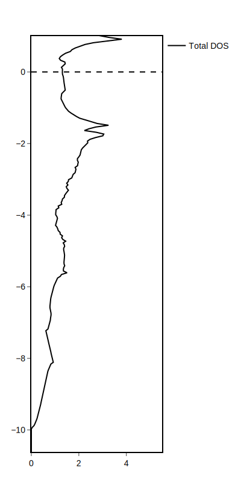
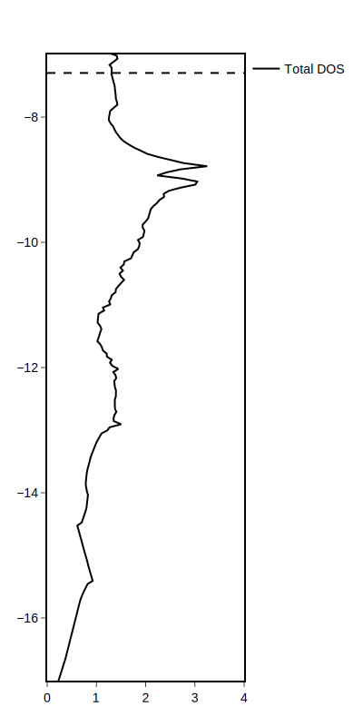
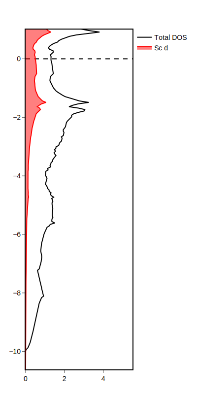

# Prepare files and use PlotDFT
We'll walk through the PDOS_ScAl3 example.

To plot DOS data, we need to read information from three VASP files:
* `OUTCAR` - the Fermi energy
* `POSCAR` - crystallographic geometry
* `DOSCAR` - the DOS distributions

Copy these files from the [examples](https://github.com/xamberl/PlotDFT/tree/main/examples/PDOS_ScAl3) into a working directory. Open the Julia REPL in your working directory and load PlotDFT.jl
```@repl
using PlotDFT
```
!!! note
    It is recommended to write these commands in a `.jl` file, so that commands to generate your plot are saved and can be rerun. See the example [`PDOS_ScAl3.jl`](https://github.com/xamberl/PlotDFT/blob/main/examples/PDOS_ScAl3/PDOS_ScAl3.jl).

# Importing data from files
Now we must extract the relevant data from our VASP files. To do this, we use [`import_DOS_VASP`](@ref).
```julia
dos = import_DOS_VASP()
```
By default, it will check the current directory for the three files. If your files are in another directory, you can specify the directory as an argument.
```julia
dos = import_DOS_VASP("/path/to/files")
```
The relevant information is stored into our `dos` variable, which is a [`PlotDFT.DOSinfo`](@ref) struct. You can see information about our system.
```
DOSinfo: Al₃Sc
 Atom type 1: Sc
 Projected DOS is l-decomposed: (1) s, (2) p, (3) d
 Atom type 2: Al
 Projected DOS is l-decomposed: (1) s, (2) p, (3) d
 Fermi energy: 7.2264, α+β: -14.5222
```
Here, we see the chemical formula of the system, the order of the atoms as listed in the POSCAR, information about the projected DOS (if included), and the Fermi energy.

# Plotting the total density of states
We now can use [`plot_DOS`](@ref) to generate a total DOS distribution and store the plot object in the variable `p1`.
```julia
p1 = plot_DOS(dos)
```


By default, the energies will be plotted relative to the Fermi energy (E-E<sub>F</sub>), ranging from the minimum DOS energy to 1 eV + the Fermi energy. The x-axis will range from 0 to 1.1 * the maximum states per eV. These can be modified with arguments to the function.

```julia
p1_abs = plot_DOS(dos, emin = -17, emax = -7, xmax = 4, eaxis = "absolute")
```


Now, I've specified our energy axis to be plotted in absolute units (as opposed to relative units), as well as modified the range of the energy and states axes.

# Plotting the projected density of states
Let's plot the projected density of states corresponding to the Sc 3d bands. Again, we can look at `dos` to see what type of information is available.
```
DOSinfo: Al₃Sc
 Atom type 1: Sc
 Projected DOS is l-decomposed: (1) s, (2) p, (3) d
 Atom type 2: Al
 Projected DOS is l-decomposed: (1) s, (2) p, (3) d
 Fermi energy: 7.2264, α+β: -14.5222
```
The relevant information corresponds to *Sc, atom type 1*. Our DOSCAR holds l-decomposed projected DOS information, and the options *s*, *p*, and *d* are available. We can now use [`plot_pDOS`](@ref) with our total density of states plot.
```julia
p1 = PlotDFT.plot_pDOS(p1, dos, atom=1, pdos="d", color="#FF0000")
```
Here, the required arguments are `p1` and `dos`, corresponding to our total density of states plot and information about our system, respectively. Additionally, we need to specify what atom we use with `atom=1` and which pdos to plot with `pdos="d"`. The only optional argument here is the color. The default color is black; here, it is a string corresponding to the hexadecimal for red.



# Adjusting plot formatting
We can adjust plot formatting by reaching into the PlotlyJS package's [`relayout!`](http://juliaplots.org/PlotlyJS.jl/stable/api/#PlotlyBase.relayout!-Tuple{Plot,Vararg{Any,N}%20where%20N}) function. Below is an example of formatting you might consider.
```julia
PlotDFT.relayout!(
    p2,
    title_text = "DOS distribution of AuCu<sub>3</sub>-type ScAl<sub>3</sub>",
    title_x = 0.5,
    xaxis_title_text = "states per eV",
    yaxis_title_text = "Energy (eV)",
    showlegend = false
)
```
The first argument must be the plot object (in this case, `p2`), while the rest are optional. In this example, a title is added and centered, as well as titles for the axes. In addition, the legend is turned off. See [https://plotly.com/julia/reference/layout/](https://plotly.com/julia/reference/layout/) for a list of options!


# Saving the figure
PlotlyJS can save figures in the following file formats:
* .pdf
* .html
* .json
* .png
* .svg
* .jpeg
* .webp
```julia
PlotDFT.savefig(p2, width=400, height=800, "ScAl3_Sc_d_pdos.svg")
```
Oftentimes, PlotlyJS will not save your figure in the displayed dimensions, so it's recommended to specify the dimensions (in pixels) in the arguments. You can also optionally specify a scale [(see documentation)](http://juliaplots.org/PlotlyJS.jl/stable/api/#PlotlyBase.savefig-Tuple{IO,Plot}). The last argument is a string corresponding to the path, filename, and file format of the plot.

!!! note
    For the purpose of post-processing (with graphics-editing programs like Photoshop, Illustrator, or Affinity), it is recommended to export these figures as vector-based formats, such as SVG or PDF. 

    Beware that some programs cannot open or import SVG files, so PDF is generally more accessible.