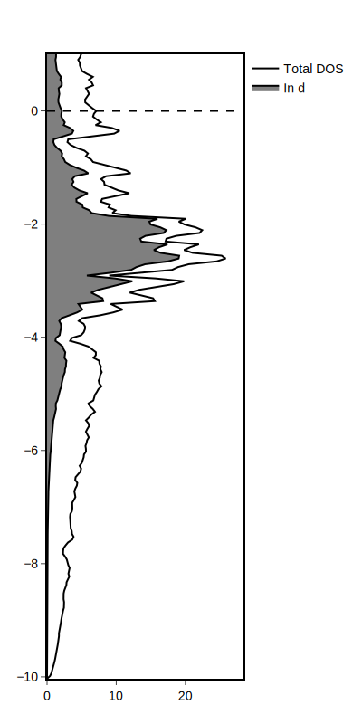
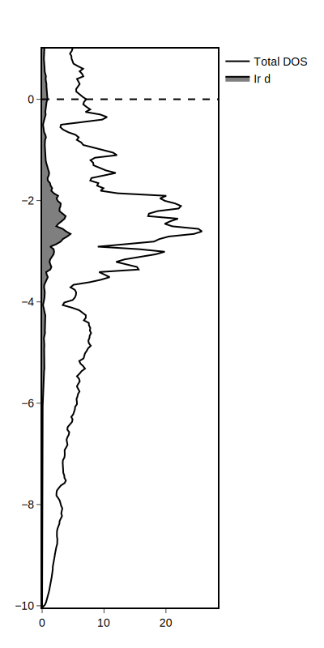
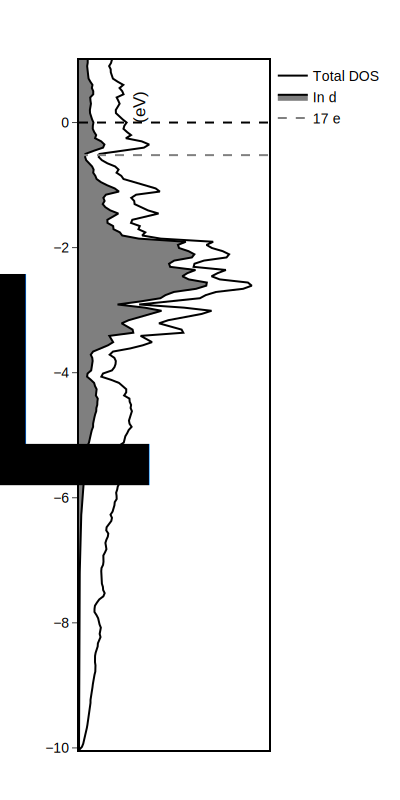

This version of the guide walks through the DOS\_lobster\_IrIn3 example. This allows us to use the DOSCAR generated by [LOBSTER](http://cohp.de).

# Prepare files and use PlotDFT
We'll walk through the DOS\_lobster\_IrIn3 example.

In this case, we need information from only two files:
* `DOSCAR.lobster` - the DOS distributions
* `POSCAR` - crystallographic geometry

Copy these files from the [examples](https://github.com/xamberl/PlotDFT/tree/main/examples/DOS_lobster_IrIn3) into a working directory. Open the Julia REPL in your working directory and load PlotDFT.jl
```@repl
using PlotDFT
```
!!! note
    It is recommended to write these commands in a `.jl` file, so that commands to generate your plot are saved and can be rerun. See the example [`DOS_lobster_IrIn3.jl`](https://github.com/xamberl/PlotDFT/blob/main/examples/DOS_lobster_IrIn3/DOS_lobster_IrIn3.jl).

# Importing data from files
Now we must extract the relevant data from our VASP files. To do this, we use [`import_DOS_lobster`](@ref).
```julia
dos = import_DOS_lobster()
```
The relevant information is stored into our `dos` variable, which is a [`PlotDFT.DOSinfo`](@ref) struct. You can see information about our system.
```
DOSinfo: In₃Ir
 Atom type 1: In
 Projected DOS is l-decomposed: (1) s, (2) py, (3) pz, (4) px
 Atom type 2: Ir
 Projected DOS is lm-decomposed: (1) s, (2) dxy, (3) dyz, (4) dz2, (5) dxz, (6) dx2-y2
 Fermi energy: 0, α+β: 0
```
Note that the Fermi energy and α+β values are not read in this import method.

# Plotting the total density of states
We now can use [`plot_DOS`](@ref) to generate a total DOS distribution and store the plot object in the variable `p`.
```julia
p = plot_DOS(dos)
```


!!! note
    By default, the energies will be plotted relative to the Fermi energy, ranging from the minimum DOS energy to 1 eV + the Fermi energy. The x-axis will range from 0 to 1.1 * the maximum states per eV. These can be modified with arguments to the [`plot_DOS`](@ref) function.


# Plotting the projected density of states
Let's plot the projected density of states corresponding to the Ir 5d bands. Again, we can look at `dos` to see what type of information is available.
```
DOSinfo: In₃Ir
 Atom type 1: In
 Projected DOS is l-decomposed: (1) s, (2) py, (3) pz, (4) px
 Atom type 2: Ir
 Projected DOS is lm-decomposed: (1) s, (2) dxy, (3) dyz, (4) dz2, (5) dxz, (6) dx2-y2
 Fermi energy: 0, α+β: 0
```
The relevant information corresponds to *Ir, atom type 2*. Our DOSCAR holds lm-decomposed projected DOS information. We can now use [`plot_pDOS`](@ref) with our total density of states plot.
```julia
p1 = plot_pDOS(p, dos, atom=2, pdos="d")
```
Here, the required arguments are `p` and `dos`, corresponding to our total density of states plot and information about our system, respectively. Additionally, we need to specify what atom we use with `atom=1` and which pdos to plot with `pdos="d"`.



We can also project a specific d orbital. For example, let's select the Ir 5d<sub>z<sup>2</sup></sub> orbitals.
```julia
p2 = plot_pDOS(p, dos, atom=2, pdos="dz2")
```


# Adjusting the energy at hypothetical electron counts
IrIn₃ is an 18-electron compound. We can see what energy corresponds to an 17-electron valence electron count.
```julia
p3 = energy_at_electron_ct(dos, 68, p1, color="gray")
p3.plot.data[end].name = "17 e<sup>-</sup>/f.u."
```
Here, `68` corresponds to `4 * 17` electrons for the number of formula units in the POSCAR. The second line changes the label of the line.

!!! note
    The p1 argument is optional and plots the energy. Without it, the function just returns the energy as number. See documentation [`energy_at_electron_ct`](@ref).

# Adjusting plot formatting
We can adjust plot formatting by reaching into the PlotlyJS package's [`relayout!`](http://juliaplots.org/PlotlyJS.jl/stable/api/#PlotlyBase.relayout!-Tuple{Plot,Vararg{Any,N}%20where%20N}) function. Below is an example of formatting you might consider.
```julia
PlotDFT.relayout!(
    p3,
    yaxis_title_text = "E-<i>E</i><sub>F</sub> (eV)",
    xaxis_showticklabels = false,
    xaxis_ticks = "",
);
```
The first argument must be the plot object (in this case, `p3`), while the rest are optional. In this example, a title is added and centered, as well as titles for the axes. In addition, the legend is turned off. See [https://plotly.com/julia/reference/layout/](https://plotly.com/julia/reference/layout/) for a list of options!



# Saving the figure
PlotlyJS can save figures in the following file formats:
* .pdf
* .html
* .json
* .png
* .svg
* .jpeg
* .webp
```julia
PlotDFT.savefig(p3, width=400, height=800, "IrIn3_lobDOS.svg")
```
Oftentimes, PlotlyJS will not save your figure in the displayed dimensions, so it's recommended to specify the dimensions (in pixels) in the arguments. You can also optionally specify a scale [(see documentation)](http://juliaplots.org/PlotlyJS.jl/stable/api/#PlotlyBase.savefig-Tuple{IO,Plot}). The last argument is a string corresponding to the path, filename, and file format of the plot.

!!! note
    For the purpose of post-processing (with graphics-editing programs like Photoshop, Illustrator, or Affinity), it is recommended to export these figures as vector-based formats, such as SVG or PDF. 

    Beware that some programs cannot open or import SVG files, so PDF is generally more accessible.