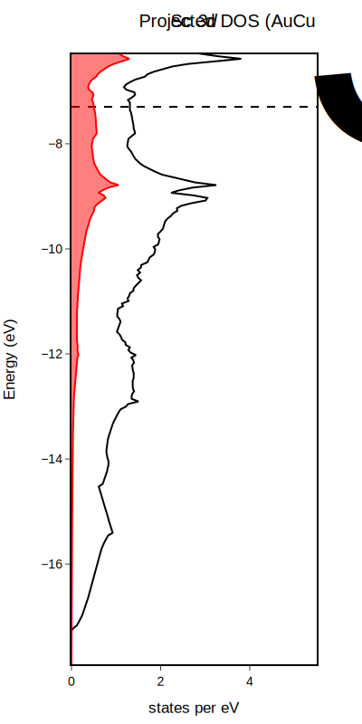

# PlotDFT.jl
Scripts for plotting basic DFT data from VASP with Julia.
Plots can be exported in any of the formats allowed by PlotlyJS for post-processing, including .pdf, .html, .json, .png, .svg, .jpeg, and .webp.



See examples for more detail.

# Dependencies
* [Electrum.jl](https://github.com/brainandforce/Electrum.jl) for reading DFT data
* PlotlyJS for plotting

# Current features
* Plot the total DOS and projected DOS (l- and lm- decomposed) from VASP's outputs
* Plot DOS from files generated from [LOBSTER](http://cohp.de)

# Planned features
* Customize legend
* Plot spin-polarized DOS.
* Plot band structures.
* Plot -pCOHP curves from LOBSTER.
* Plot phonon DOS and band structures.

# Installation
If you haven't already, install [Julia](https://julialang.org/).

Open the Julia REPL and access the package manager by typing `]`. Add `PlotDFT.jl`.
```
(@v1.8) pkg> add https://github.com/xamberl/PlotDFT.git
```